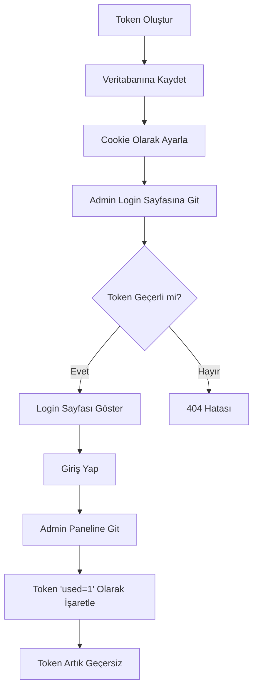

# 🔐 Rotating Token Security System

## En Üst Düzey Admin Güvenlik Sistemi

Bu proje, **Rotating Token** sistemi ile korunmaktadır. Bu, endüstri standardı güvenlik seviyesinde bir sistemdir.

---

## 🎯 Hızlı Başlangıç (3 Adım)

### 1️⃣ Token Oluştur

Tarayıcıda aç:
```
http://localhost:8080/admin/generate_access_token.php
```

### 2️⃣ Otomatik Ayarla

**"Token'ı Otomatik Ayarla"** butonuna tıkla

### 3️⃣ Giriş Yap

Yönlendirildiğin admin sayfasında console ye adminin tokenini girmen lazım.
Admin login sayfasına otomatik yönlendirileceksin, bilgilerinle giriş yap!

Zaten bunun nasıl yapıldığı diğer dosyalarda detaylı bir şekilde anlatılmıştır.
---

## 🛡️ Güvenlik Özellikleri

| Özellik | Açıklama | Güvenlik Seviyesi |
|---------|----------|-------------------|
| **Rotating Token** | Her erişim için yeni token | ⭐⭐⭐⭐⭐ |
| **Tek Kullanımlık** | Token bir kez kullanılır | ⭐⭐⭐⭐⭐ |
| **Zamanaşımı** | 24 saat otomatik expire | ⭐⭐⭐⭐⭐ |
| **Veritabanı Kontrolü** | Her token DB'de doğrulanır | ⭐⭐⭐⭐⭐ |
| **IP Tracking** | Hangi IP kullandı kaydedilir | ⭐⭐⭐⭐ |
| **404 Response** | Yetkisiz = "sayfa yok" | ⭐⭐⭐⭐⭐ |
| **Auto Cleanup** | Eski token'lar otomatik silinir | ⭐⭐⭐⭐ |
| **Cryptographically Secure** | random_bytes(32) - 64 karakter | ⭐⭐⭐⭐⭐ |

---

## 🔄 Token Yaşam Döngüsü



---

## 📊 Token Veritabanı

Her token şu bilgilerle saklanır:

- ✅ **Token** - 64 karakter kriptografik güvenli string
- ✅ **Oluşturulma Zamanı** - Ne zaman oluşturuldu
- ✅ **Geçerlilik Süresi** - Ne zaman expire olacak
- ✅ **Kullanım Durumu** - Kullanıldı mı?
- ✅ **Kullanım Zamanı** - Ne zaman kullanıldı
- ✅ **IP Adresi** - Hangi IP'den kullanıldı

---

## 🚀 Kullanım Senaryoları

### Senaryo 1: İlk Erişim
```
1. generate_access_token.php aç
2. Yeni token oluştur → abc123...
3. Token'ı cookie'ye ayarla
4. admin_login.php'ye git ✅
5. Giriş yap ✅
6. Admin paneline eriş ✅
```

### Senaryo 2: Yetkisiz Erişim
```
1. Direkt admin_login.php'ye git
2. Token yok ❌
3. 404 Hatası görürsün ❌
4. Hiçbir bilgi sızdırılmaz ✅
```

### Senaryo 3: Kullanılmış Token
```
1. Token oluştur → abc123...
2. Admin paneline gir (token kullanıldı)
3. Çıkış yap
4. Tekrar gir → Token geçersiz ❌
5. Yeni token oluştur → def456...
6. Tekrar gir ✅
```

### Senaryo 4: Süresi Dolmuş Token
```
1. Token oluştur → abc123...
2. 24 saat bekle ⏰
3. admin_login.php'ye git
4. Token expire olmuş ❌
5. 404 Hatası
6. Yeni token oluştur
```

---

## 🔒 Neden Bu Kadar Güvenli?

### 1. **Brute Force İmkansız**
- Token 64 karakter (2^256 olasılık)
- Tahmin etmek matematiksel olarak imkansız

### 2. **Replay Attack Koruması**
- Token bir kez kullanılır
- Birisi yakalar bile kullanamaz

### 3. **Time-Based Security**
- 24 saat sonra otomatik expire
- Çalınan token bile zamanla geçersiz olur

### 4. **Database-Backed**
- Her token DB'de doğrulanır
- Cookie manipülasyonu işe yaramaz

### 5. **Zero Information Disclosure**
- Yetkisiz erişim = 404
- Admin paneli varmış gibi görünmez

---

## 🎓 Karşılaştırma: Diğer Sistemler

| Sistem | Güvenlik | Avantaj | Dezavantaj |
|--------|----------|---------|------------|
| **Basit Cookie** | ⭐⭐ | Kolay | Tahmin edilebilir |
| **Sabit Token** | ⭐⭐⭐ | Orta | Çalınırsa kalıcı |
| **JWT** | ⭐⭐⭐⭐ | Stateless | Revoke edilemez |
| **Rotating Token** | ⭐⭐⭐⭐⭐ | En güvenli | Biraz karmaşık |

---

## 💡 İleri Seviye Özellikler

### Token Süresini Özelleştir

`generate_access_token.php` içinde:

```php
// 24 saat yerine 1 saat:
$expiresAt = date('Y-m-d H:i:s', strtotime('+1 hour'));

// 7 gün:
$expiresAt = date('Y-m-d H:i:s', strtotime('+7 days'));

// 30 dakika:
$expiresAt = date('Y-m-d H:i:s', strtotime('+30 minutes'));
```

### Otomatik Temizleme Sıklığını Ayarla

Şu anda her token oluşturulduğunda eski token'lar temizlenir:

```php
// 7 gün yerine 1 gün:
DELETE FROM Admin_Access_Tokens 
WHERE datetime(created_at) < datetime('now', '-1 days', 'localtime')
```

### IP Whitelist Ekle

`admin_login.php` ve `admin/panel.php` içinde:

```php
$allowedIPs = ['127.0.0.1', '192.168.1.100'];
if (!in_array($_SERVER['REMOTE_ADDR'], $allowedIPs)) {
    // Erişim engellendi
    exit;
}
```

---

## 📈 Token İstatistikleri

Veritabanında token istatistiklerini görmek için:

```sql
-- Toplam oluşturulan token sayısı
SELECT COUNT(*) as total_tokens FROM Admin_Access_Tokens;

-- Kullanılan token sayısı
SELECT COUNT(*) as used_tokens FROM Admin_Access_Tokens WHERE used = 1;

-- Aktif (kullanılmamış ve expire olmamış) token sayısı
SELECT COUNT(*) as active_tokens 
FROM Admin_Access_Tokens 
WHERE used = 0 
AND datetime(expires_at) > datetime('now', 'localtime');

-- Son 10 token kullanımı
SELECT token, created_at, used_at, ip_address 
FROM Admin_Access_Tokens 
WHERE used = 1 
ORDER BY used_at DESC 
LIMIT 10;
```

---

## ⚠️ Üretim Ortamı İçin Önemli Notlar

### 1. generate_access_token.php Koruması

Üretim ortamında bu dosyayı koruyun:

```php
// Dosyanın başına ekle:
if ($_SERVER['REMOTE_ADDR'] !== 'YOUR_IP_ADDRESS') {
    http_response_code(403);
    exit;
}
```

### 2. HTTPS Zorunlu

```php
if (empty($_SERVER['HTTPS']) || $_SERVER['HTTPS'] === 'off') {
    header('Location: https://' . $_SERVER['HTTP_HOST'] . $_SERVER['REQUEST_URI']);
    exit;
}
```

### 3. Rate Limiting

Token oluşturmada rate limiting ekle:

```php
// Aynı IP'den dakikada en fazla 3 token
if (getTodayTokenCount($_SERVER['REMOTE_ADDR']) > 3) {
    die('Rate limit exceeded');
}
```

---

## 🎉 Sonuç

Bu sistem ile admin paneliniz **FORT KNOX** seviyesinde korunmuştur! 🏰

Daha fazla bilgi için: `ADMIN_ACCESS_GUIDE.md`

---

**Oluşturan:** Patronibo  
**Versiyon:** 1.0.0  
**Tarih:** 2025-10-20

